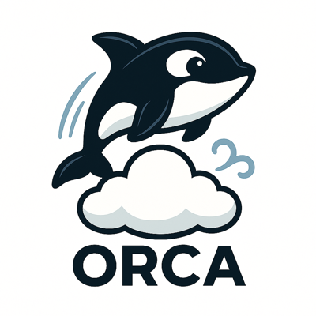
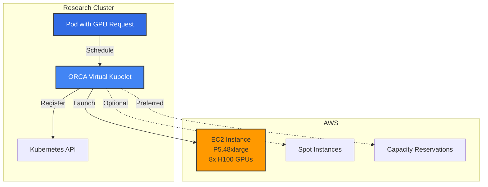

# ORCA - Orchestration for Research Cloud Access

  

**ORCA** enables research institutions to seamlessly burst Kubernetes workloads from on-premises clusters to AWS, with native support for GPU-intensive AI/ML computing.

## What is ORCA?

ORCA (Orchestration for Research Cloud Access) is a Kubernetes Virtual Kubelet provider that allows research computing clusters to dynamically extend capacity to AWS when local resources are exhausted.

## Key Features

- 🎓 **Research-First Design** - Built for academic and research workloads
- 🖥️ **AI/ML Accelerators** - Support for NVIDIA GPUs (P6, P5, P4d, G6e), AWS Trainium, Inferentia, and FPGAs
- 🎯 **Explicit Control** - Users specify exact instance types, not guessed
- 💰 **Cost-Aware** - Budget controls, cost tracking, spot instance support
- 🔓 **Open Source** - Apache 2.0 licensed, community-driven

## Quick Links

-   :material-rocket-launch:{ .lg .middle } __Getting Started__

    ---

    Get ORCA up and running in minutes

    [:octicons-arrow-right-24: Quick Start](getting-started/quick-start.md)

-   :material-book-open-variant:{ .lg .middle } __User Guide__

    ---

    Learn how to use ORCA for your workloads

    [:octicons-arrow-right-24: User Guide](user-guide/index.md)

-   :material-sitemap:{ .lg .middle } __Architecture__

    ---

    Understand how ORCA works

    [:octicons-arrow-right-24: Architecture](architecture/index.md)

-   :material-code-braces:{ .lg .middle } __Development__

    ---

    Contribute to ORCA development

    [:octicons-arrow-right-24: Development](development/index.md)

## Architecture Overview

## Use Cases

### AI/ML Training
Burst large model training to AWS GPUs, Trainium, or Inferentia when local clusters are full.

### Cost-Optimized Computing
Use Trainium for 50% lower training costs or Inferentia for 70% lower inference costs compared to GPUs.

### Research Computing
Access specialized hardware on-demand: FPGAs for genomics, latest GPUs for deep learning.

### Multi-Tenant Research
Support multiple departments with separate budgets and cost tracking.

## Why ORCA?

### vs. Elotl Kip
- **Kip is EOL** (last updated 2021) - stuck on K8s 1.18, AWS SDK v1
- **ORCA is modern** - K8s 1.34, AWS SDK v2, Go 1.25, latest instance types (P6, G6e)
- **ORCA prioritizes explicit control** - users know their requirements

### vs. AWS Fargate Virtual Kubelet
- **Fargate provider is unmaintained** and doesn't support GPUs
- **ORCA is GPU-first** - built for AI/ML research

### vs. Building on Managed K8s
- **ORCA extends existing clusters** - research institutions already have K8s
- **No migration needed** - burst workloads, keep existing infrastructure

## Project Status

**Current Phase**: Active Development (v0.1.0-dev)

- ✅ Core architecture designed and implemented
- ✅ AWS EC2 integration complete
- ✅ Instance selection (explicit, template, auto)
- ✅ Virtual Kubelet integration
- 🚧 Container runtime integration (in progress)
- ⏳ GPU capacity reservations (v0.2.0)
- ⏳ kubectl logs/exec (v0.2.0)

## Community

- **GitHub**: [scttfrdmn/orca](https://github.com/scttfrdmn/orca)
- **Issues**: [Report bugs or request features](https://github.com/scttfrdmn/orca/issues)
- **License**: [Apache 2.0](https://github.com/scttfrdmn/orca/blob/main/LICENSE)

## Getting Help

- 📖 [Read the docs](getting-started/index.md)
- 🐛 [Report issues](https://github.com/scttfrdmn/orca/issues)
- 💬 [Discussions](https://github.com/scttfrdmn/orca/discussions)
- 🤝 [Contributing guide](CONTRIBUTING.md)

---

*Built with 🌊 for research computing*
